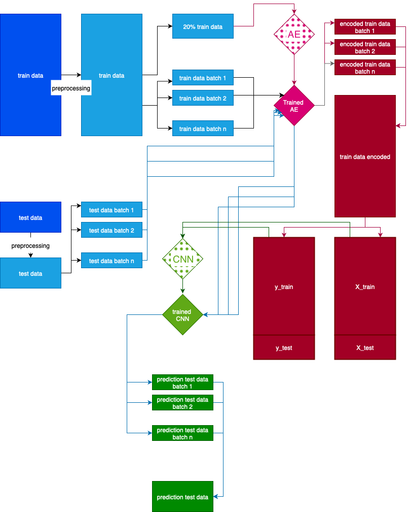

# DRW Challenge – Crypto Market Prediction. AE + CNN Pipeline

This repository contains an end-to-end machine learning pipeline for processing train/test data, encoding it using an Autoencoder (AE), and classifying it with a Convolutional Neural Network (CNN). The included diagram illustrates the complete workflow.
---

## 📌 Project Overview

The originial challenge: https://www.kaggle.com/competitions/drw-crypto-market-prediction
Test-set metrics are not reported because the challenge uses a submission-based evaluation that does not expose traditional metrics. My focus was implementing autoencoders and building batch-processing and parallel-computing pipelines.
The pipeline follows these major steps:

1. **Preprocessing**
   - Both train and test datasets are preprocessed to ensure consistency and compatibility with the models.

2. **Data Splitting**
   - The training set is split into:
     - **20% validation subset** for training the VAE.
     - Multiple batches for efficient processing.

3. **Autoencoder (AE)**
   - The AE is trained on the training data subset.
   - Once trained, it encodes:
     - All training batches.
     - All test batches.
   - Produces **encoded representations** of the datasets.

4. **CNN Classifier**
   - The encoded train data (`X_train`) and labels (`y_train`) are used to train the CNN.
   - The trained CNN is then applied to encoded test batches.

5. **Prediction**
   - Predictions from test batches are combined into the final test prediction set.

---

## 🔄 Workflow Diagram

---

## 📂 Repository Structure
├── eda.py # Exploratory Data Analysis
├── process_chunk.py # Chunk-based data processing
├── run_all_chunks.sh # Batch processing script
├── autoencoder_model-2.h5 # Trained VAE model 
├── cnn_model.joblib # Trained CNN model
├── sample_submission.csv # Example submission format
├── sub_predictions.csv # Model prediction output
├── predicted_chunks/ # Encoded batch outputs (large files, not tracked in git)
└── drw_challenge.png # Workflow diagram

Created by Zhuldyz Ualikhankyzy
For any questions or suggestions, please open an issue or pull request.

